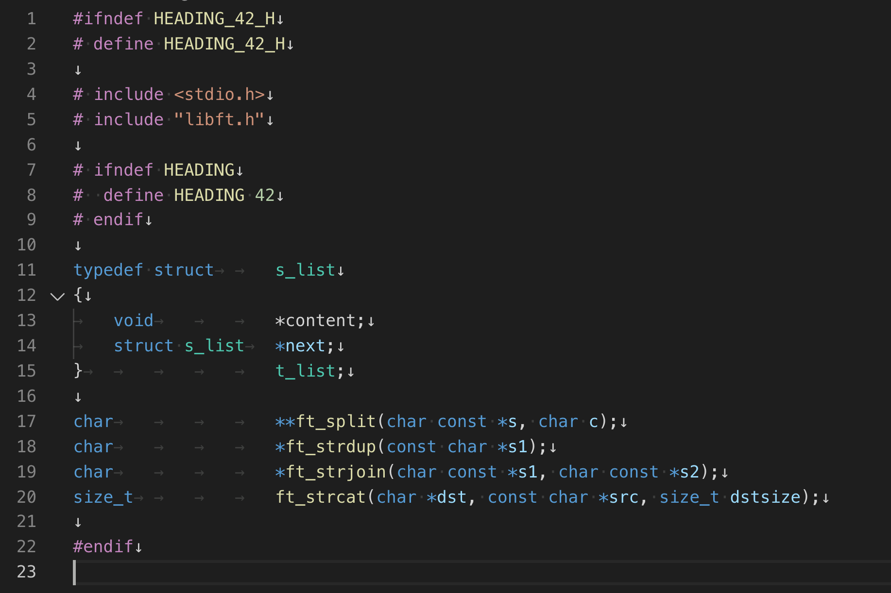

# HEADING_42 (v1.0 / 2020.10.24)

>
> "Heading_42 is a program that reads .c files, parses the types of functions, and automatically creates a header file."
>
> "Heading_42는  .c 파일들을 읽어서 함수들의 프로토타입을 파싱하여 자동으로 헤더파일을 생성해주는 프로그램 입니다."
>
> `Sample header made by HEADING_42`
> 

## 🚀 Usage
### Installation
>
> "Clone this repository into your working directory."
>
>- Copy `git clone https://github.com/Likilee/HEADING_42.git`
>

### Setting
>- [x] Modify `my_config.h` file.
>- [x] Edit the `my_struct.h` file to add the structure.

### Run
>- `bash heading42.sh`

----

## Design
### 🥊 Header file configuration

> The generated header file is written in the following order.

| Top (#ifndef HEADER_NAME_H)               |
| ---------------- |
| Includes (#include lib)   |
| Define (#define mecro)   |
| Struct (Define struct)   |
| Prototype (Get prototype from C_files) |
| Finish (#endif) |

### 🥊 Function specification

| Program name | Heading_42 |
| ---------------- | -------------- |
| Core 1 | Read the source file and automatically create the header file. |
| Core 2 | Sort according to 42_norminette criteria. |

>- [x] Only prototypes excluding static should be included in the header file.
>- [x] Header file must be defined by changing the file name to upper case according to the ifndef define rule.
>- [x] Only .c files in the specified source file directory should be read.
>- [x] Header file must be created according to 42norminette rules.
>- [x] Exclude the main.c file when importing prototypes.

### ✅ Update

2020/10/24
> 이슈 수정 : SRC_NAME_COMMENT 1 일 때, 개행문자 한개 추가되는 문제 FIX
>
> version 1.0 완성.
>
2020/10/23

> Makefile 명령줄 출력안되게 @ 붙여서 수정
>
> My_config에 SRC_NAME_COMMENT 추가
>
> SRC_NAME_COMMENT옵션 추가에 따라 타 소스코드 일부 변경
>
> 디렉토리명 변경

2020/10/20
> MECRO -> MACRO 오타 수정
>
> README.md -> my_struct.h 오타 수정
>
>  Makefile 오류 수정(NAME 선언시 뒤에 ; 붙였었음)
>
> struct 에 tab이 하나도 없을 때 예외처리 추가
>
> gnl utils 제거 > ft_ 로 분리

2020/10/19

> 프로그램 등록
